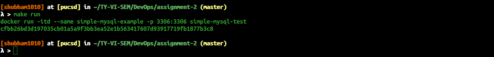
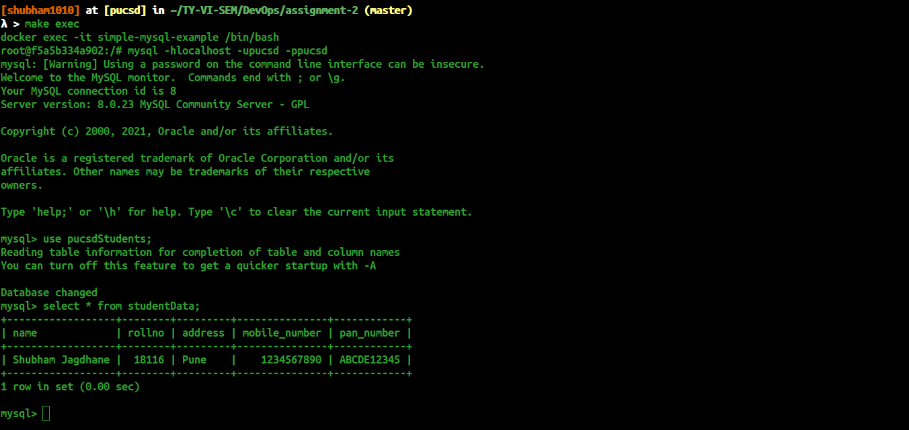
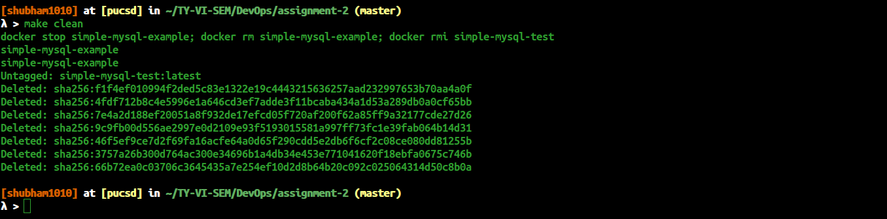

# Assignment-2: Dockerfile-Build image with loaded MySQL schema

In this assignment we have to write Dockerfile from which we can build our require image to start the container to achive our target. Our target is whenever the container start we should see the database having students table containing your roll number, name and course.<br />
I have used mysql image to build my customize image and to start the container.

## Makefile commands
```
1. make build => builds image from the Dockerfile
2. make run   => create and start container from the built image
3. make exec  => to go inside created container
4. make clean => deletes started container, built image
```

## Getting Started

1. Clone the project
2. cd devops-assignments/assignment-2
3. make build

4. make run

5. Please make sure that container is running successfully by using `docker ps` command
6. make exec

6. make clean



Note:
```
The MySQL container's port 3306 is mapped with the host machine's port 3306
```

### Prerequisite
```
Docker
Make (not mandatory)
```

### Installtion

1) [Docker](https://www.docker.com/)&nbsp;:&nbsp; Docker image and container command line interface
To install docker on you machine [click here](https://docs.docker.com/get-docker/)

2) [Make](https://www.gnu.org/software/make/)&nbsp;&nbsp;&nbsp;&nbsp;:&nbsp; GNU make utility to maintain groups of programs

## Built with Stack

* [Docker]() &nbsp;-&nbsp; Used to build image and start the container from built image
* [Make]()&nbsp; &nbsp;  &nbsp;-&nbsp; Used to get ease with commands, less writing
