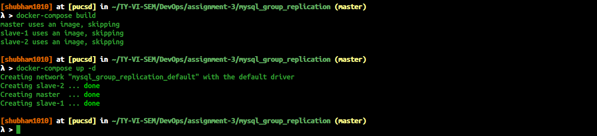
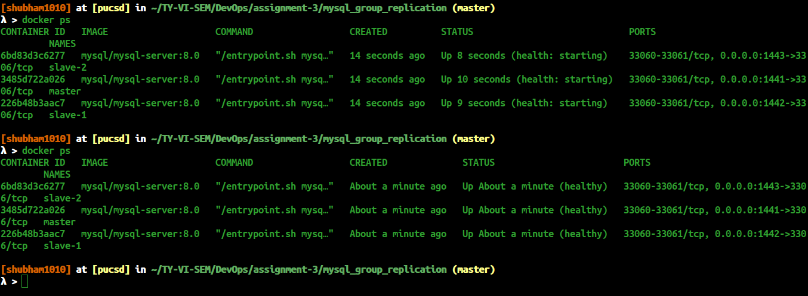
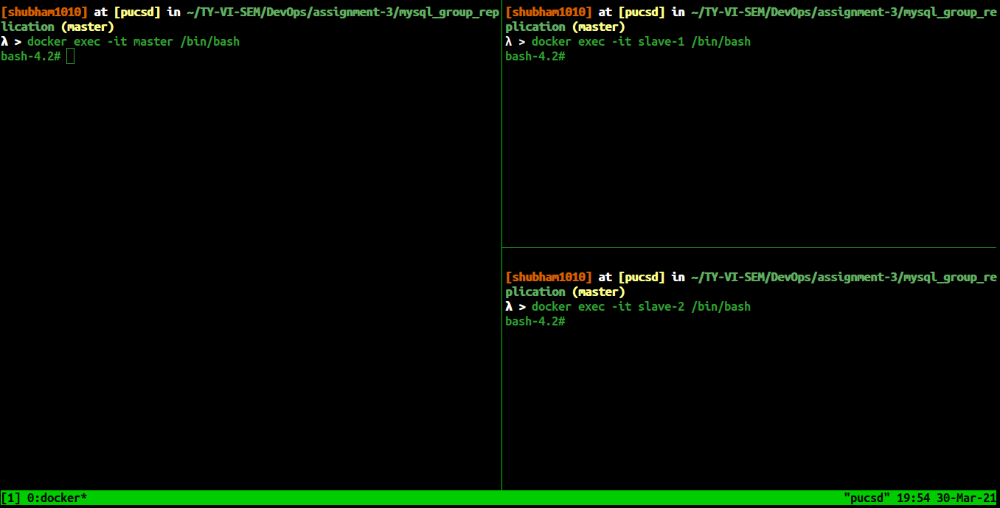
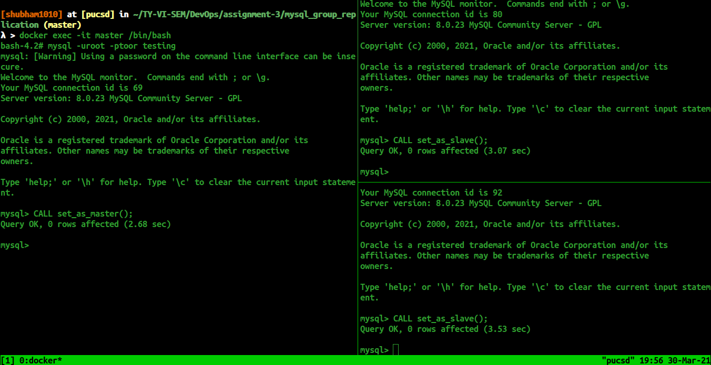
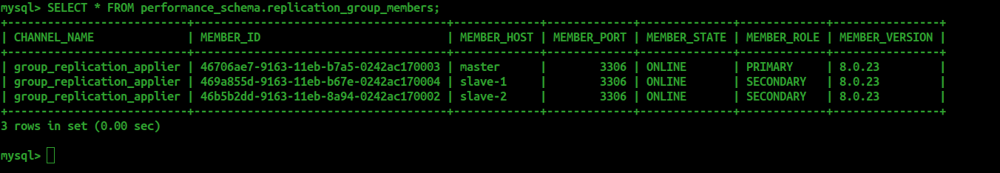
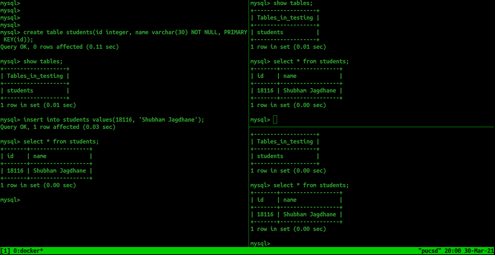

# MySQL Cluster using MySQL Group Replication

via docker containers and docker-compose

Please execute below commands to get start with

    docker-compose build
    docker-compose up -d



Config for all mysql services (8.x version) (it's identical for all of them except "--loose-group-replication-local-address={ some uniq name }:6606" command)
located in [my-cnf](./configs/my-cnf) file (with comments).

Please wait till containers gets healthy running




Lets connect to the MySQL group replication nodes via `docker exec` command as follow
```
docker exec -it server-name /bin/bash
```




Now lets connect to the MySQL instances as follow.
!! Be sure that you're running first master node than slaves !!

setup master node (run next commands in mysql. Explanation of this procedure located in scripts/my-init.sql):



Keep in mind, 
in master node, we are calling `CALL set_as_master();` and for slave nodes we are calling `CALL set_as_slave();` commands which invokes the function written in [my-init.sql](./scripts/my-init.sql) file.

At this point we have successfully created our MySQL Three nodes Group Replication Architecture.
To check is it working execute below command

    SELECT * FROM performance_schema.replication_group_members;



Here our nodes are running successfully. <br />
Now lets test actually replication is happening or not.
I'm going to create `students` table in master node and inserting record into `students` table and executing select query in other two slave nodes



Here our Slave nodes successfully replicated the data and <br />
Ola, here our MySQL Master-Slave Three Node cluster is successfully working. <br />
You can also play with it :)

## In this implementation works auto failover. So if master will go down or become unreachable, some of the slaves will become the master.
